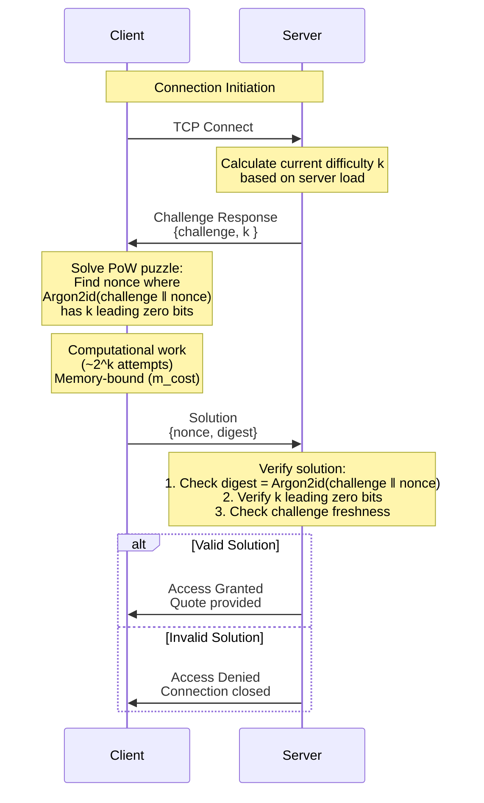

# Overview

To meet DDoS protection requirements, add a Proof-of-Work (PoW) algorithm on the server side to make attacks more expensive. The main task is to implement a PoW algorithm that maximally protects against DDoS attacks. **The primary goal of this document is to choose the PoW algorithm.**

---

# PoW Protocol Flow

## Sequence Diagram



## Flow Description

### 1. **Connection Request**
Client initiates TCP connection to server.

### 2. **Challenge Issued**
Server responds with PoW challenge containing:
- **`challenge`**: Random bytes (e.g., 32 bytes)
- **`k`**: Current difficulty (leading zero bits required)
- **`m_cost`**: Memory cost parameter (64 MiB)
- **`t_cost`**: Time cost parameter (3 iterations)

### 3. **Client Computation**
Client searches for a nonce such that:
```
Argon2id(challenge || nonce, m_cost, t_cost) → digest with k leading zero bits
```
Expected attempts: `~2^k` trials

### 4. **Solution Submission**
Client sends:
- **`nonce`**: Found nonce value
- **`digest`**: Computed Argon2id digest

### 5. **Server Verification**
Server performs:
1. Recompute: `digest' = Argon2id(challenge || nonce, m_cost, t_cost)`
2. Verify: `digest' == digest`
3. Check: First `k` bits of digest are zero
4. Validate: Challenge is recent (not expired/reused)

### 6. **Access Decision**
- ✅ **Valid**: Grant access, establish session
- ❌ **Invalid**: Reject connection, log attempt

---

# Algorithm Options

## 1. HashCash

### Overview

HashCash is a Proof-of-Work scheme built on a cryptographic hash function (originally SHA-1, often SHA-256 today).

**Algorithm:** A client iterates a nonce until the hash of a token has at least **`k`** leading zero bits.

**Complexity:** `~2^k` trials required.

**Verification:** Single hash operation (very fast).

### Pros

- ✅ Clear, compact spec with countless examples
- ✅ Verification is a single hash
- ✅ Uses standard hash functions with libraries available in most languages

### Cons

- ❌ **ASIC and GPU friendly** (attackers can parallelize cheaply)

---

## 2. Argon2id ⭐

### Overview

**Argon2id** is a memory-hard function (hybrid of Argon2i/Argon2d) that requires meaningful RAM and reduces GPU/ASIC advantages.

**Algorithm:** The client searches a nonce such that:

```
Argon2id(challenge || nonce) → digest with k leading zero bits
```

**Parameters:**
- **`m_cost`**: Memory usage (in KiB)
- **`t_cost`**: Time cost (number of iterations)
- **`k`**: Difficulty (number of leading zero bits)

**Verification:** Single evaluation (keep `m_cost`/`t_cost` moderate so verification stays cheap).

### Pros

- ✅ **Memory-hard**: Requires meaningful RAM, shrinking GPU/ASIC advantages
- ✅ Limits cheap massive parallelism
- ✅ Standardized ([RFC 9106](https://www.rfc-editor.org/rfc/rfc9106.html))
- ✅ Widely implemented across languages
- ✅ Proven stable in production over years

### Cons

- ⚠️ More CPU time and RAM per attempt
- ⚠️ Can hurt mobile/low-end devices and add latency

---

## 3. Cuckoo Cycle

### Overview

**Cuckoo Cycle** is a memory-bound Proof-of-Work where the task is to find a cycle of fixed length in a large sparse bipartite graph deterministically derived from a challenge and nonce (often via SipHash).

**Algorithm:** Find a cycle in a graph where:
- Edges are generated via `SipHash(challenge || nonce || edge_index)`
- Cost is dominated by random memory accesses

**Parameters:**
- **`edgebits`**: Graph size parameter (controls difficulty)
- **Target**: Acceptance threshold

**Verification:** Fast—check that submitted edges form the required cycle.

### Pros

- ✅ Forces heavy, memory-bound work on the solver
- ✅ Server verification in fixed, minimal time

### Cons

- ❌ No widely accepted specification
- ❌ Limited popularity and few maintained implementations
- ❌ Insufficient real-world production use (resilience not yet proven)

---

## 4. Merkle Tree Proof (MTP)

### Overview

**MTP (Merkle Tree Proof)** is a memory-hard PoW where:
1. Solver fills a large memory array via a deterministic procedure
2. Builds a Merkle tree over it
3. Submits the root plus a small set of authenticated samples as proof

**Verification:** Check samples and Merkle paths (fast, near-constant-time) instead of recomputing whole memory.

### Pros

- ✅ High memory cost for solvers limits cheap massive parallelism
- ✅ Fast verification via Merkle proofs

### Cons

- ❌ Higher implementation complexity
- ❌ Larger proofs
- ❌ Fewer standardized, production-grade libraries
- ❌ Ecosystem lacks maintained, well-documented implementations

---

# Conclusion

## Selected Algorithm: **Argon2id** ⭐

We will use **Argon2id** with [RFC 9106 "Recommended parameters, set #2"](https://www.rfc-editor.org/rfc/rfc9106.html#name-recommendations) (the profile intended for memory-constrained applications).

### Parameters (RFC 9106, Set #2):
- **`m_cost`**: 64 MiB memory
- **`t_cost`**: 3 iterations
- **`parallelism`**: 4 threads

### Difficulty Tuning:
- Variable **`k`** (leading zero bits) based on server load
- When load exceeds defined thresholds → **increase `k`** in logarithmic, stepwise increments

### Rationale:
- Strong reputation and battle-tested security
- Broad library availability across languages
- Reduced GPU/ASIC advantage compared to HashCash
- Memory-hard properties deter cheap parallelization

---

# Additional Notes

## Note on MTP (Merkle Tree Proof) Schemes

From a theoretical standpoint, **MTP schemes are very attractive**: they offer the memory-hard advantages we want (akin to Argon2id) and enable fast, sample-based verification via Merkle proofs.

**However:**
- Public implementations are scarce
- Not widely adopted
- Lack strong, battle-tested reputation with proven security

**Conclusion:** Absent ecosystem and library constraints, choosing an MTP-based design would be a natural—and likely optimal—option.

---

## Note on Adaptive Complexity

The current description uses a **simplified adaptation**. In practice, this can be upgraded to an **EMA-smoothed, spike-aware controller**:

### Enhanced Formula:
```
Two-rate EWMA with α_up > α_down:

difficulty(t) = {
  difficulty(t-1) + α_up × Δ     if load_spike detected
  difficulty(t-1) - α_down × Δ   if load decreasing
}

where:
  α_up > α_down  (e.g., α_up = 0.3, α_down = 0.05)
```

**Benefits:**
- Raises difficulty **quickly** on sudden spikes
- Decreases difficulty **slowly** during normal conditions
- Prevents low-difficulty windows between bursts
- Hardens system against intermittent DDoS patterns

